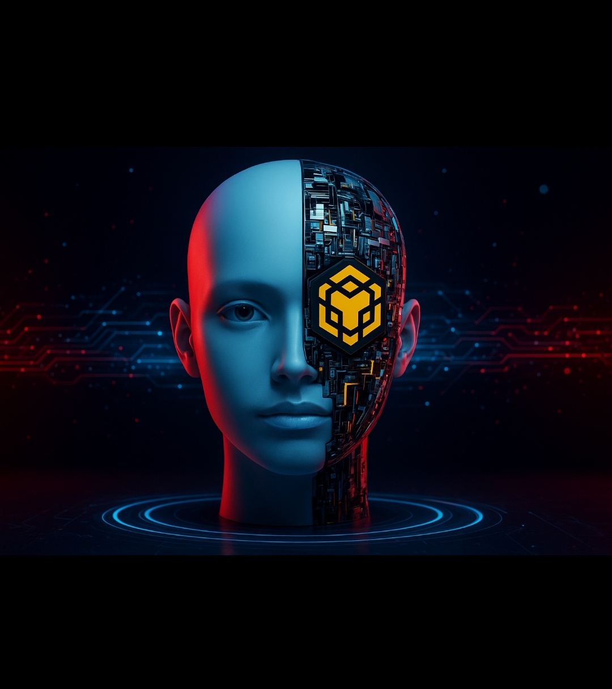

<!DOCTYPE html>
<html lang="fa">
<head>
  <meta charset="UTF-8">
  <meta name="viewport" content="width=device-width, initial-scale=1.0">
  <title>BNB AI Token 3D</title>
  
</head>
<body>
  

    

    
    <button class="start-btn" onclick="startAction()">شروع کنید</button>
  

  
</body>
</html>
